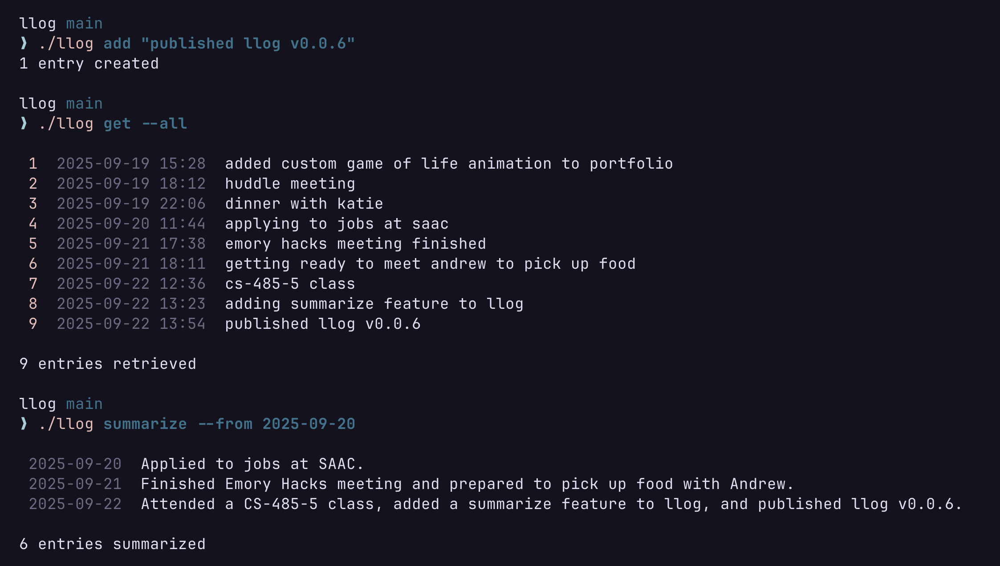

# llog

A fast, lightweight CLI for journaling directly from your terminal.

Use it as your dev log for standups, as a timestamped journal, or even as an instant memo.



## Installation

### From Releases

You can download the latest pre-compiled binary for your operating system from the [GitHub Releases](https://github.com/ethn1ee/llog/releases) page.

1.  Download the archive for your OS and architecture.
2.  Extract the `llog` binary.
3.  Move the binary to a directory in your system's `PATH` (e.g., `/usr/local/bin` on macOS/Linux).

### Go Install

If you have the Go toolchain installed, you can install `llog` with a single command.

```bash
go install github.com/ethn1ee/llog@latest
```

_(Ensure `$HOME/go/bin` is in your `PATH`)_

### Build from Source

You can also build `llog` from source if you have Go installed.

```bash
# 1. Clone the repository
git clone https://github.com/ethn1ee/llog.git
cd llog

# 2. Build the binary
go build -o llog .

# 3. Move the binary to your PATH (optional)
# For example:
# mv llog /usr/local/bin/
```

## Commands

Here are the main commands for `llog`. For a full list of flags, you can run `llog [command] --help`.

### `llog add`

Adds one or more new log entries.

```bash
llog add "Finished the project proposal." "Feeling accomplished."
```

### `llog get`

Retrieves log entries. This command has two modes:

1.  **Get by ID(s)**: Provide one or more entry IDs as arguments.

    ```bash
    llog get 123 124
    ```

2.  **Get by Filters**: Use flags to filter entries. If no flags are provided, it returns the last 10 entries.

    ```bash
    # Get the last 5 entries
    llog get --limit 5

    # Get all entries from today
    llog get --today

    # Get all entries from a specific date range
    llog get --from 2025-09-01 --to 2025-09-18
    ```

### `llog delete`

Deletes log entries. This command also has two modes:

1.  **Delete by ID(s)**: Provide one or more entry IDs as arguments.

    ```bash
    llog delete 123 124
    ```

2.  **Delete by Filters**: Use flags to specify which entries to delete.

    ```bash
    # Delete the last 5 entries
    llog delete --limit 5

    # Delete all entries from yesterday
    llog delete --yesterday
    ```

### `llog summarize`

Generates a summary of your log entries for a given period with Gemini. (`GEMINI_API_KEY` environmnet variable required)

```bash
# Summarize today's entries
llog summarize --today

# Summarize entries from a specific date range
llog summarize --from 2025-09-01 --to 2025-09-18
```
